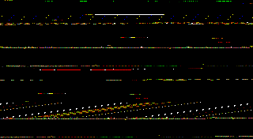

# 2D Snake Game

## A simple game created using C++ and SFML

---

### What it looks like?

### This game has multiple states
- Main Menu State - Displays main menu
- Game Play State - The actual game play
- Pause Game State - Pause screen
- Game Over State - Displays game over screen

### Features
- Snake can be controlled with arrow keys
- Snake automatically advances 16px
- Food gets randomly placed
- Snake can eat food to grow in length
- Each food increase player score by 1 point

### Build Instructions
- Requirements
    - C++ compiler
    - Make
    - SFML lib
- Just run make command to generate the executable